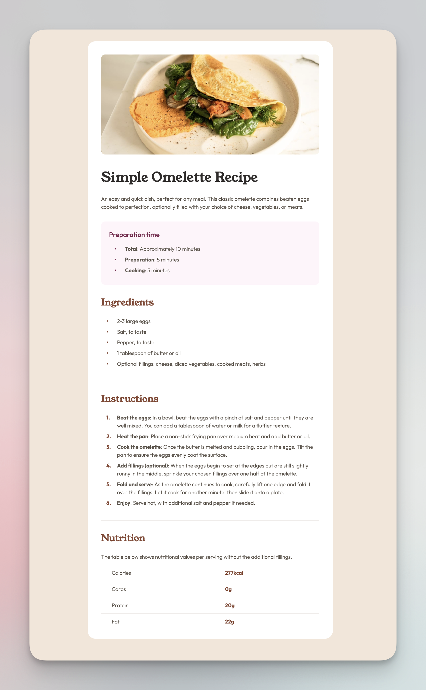

# Frontend Mentor - Recipe page solution

This is a solution to the [Recipe page challenge on Frontend Mentor](https://www.frontendmentor.io/challenges/recipe-page-KiTsR8QQKm). Frontend Mentor challenges help you improve your coding skills by building realistic projects. 

## Table of contents

- [Overview](#overview)
  - [The challenge](#the-challenge)
  - [Screenshot](#screenshot)
- [My process](#my-process)
  - [What I learned](#what-i-learned)
  - [Continued development](#continued-development)

- [Author](#author)

## Overview

### Screenshot



### Links

- Solution URL: [Add solution URL here](https://your-solution-url.com)
- Live Site URL: [Add live site URL here](https://your-live-site-url.com)

## My process

### What I learned

- Adding spaces between the bullet point and the text was a pain because I moved the bullet points inside the element where by default they're outside. This made it so that you can't use the usual padding-left trick to add space between them, it seems like it considers the bullet point now part of the <li> element, so I had to add a span to add space between.  
- this ended up being a non-issue by using the display: table-cell; trick where it treats the li as cells in a table and thus you have more control on the styling of them. Also worth remembering how to style the actual bullets or numbers of the li: list-style: none; counter-reset: item; and then you have to assing the new styles using the ol li::before{} declaration (or ul li::before)
- don't name classes and ids the same thing
- The issue here is that the <col> element can only control certain styles, such as background-color, width, and border, but it cannot directly style the text properties (like color or font-weight) inside <td> cells.

- To style only the second column’s content, use a CSS selector targeting the second <td> cell in each row, as follows:

```CSS
table td:nth-child(2) {
    font-weight: bold;
    color: var(--brown-800);
}
```

A media query is a CSS rule that applies styles only when specific conditions are met. It typically looks like this:
```CSS
@media (condition) {
  /* CSS styles go here */
}
```

### Continued development

Should probably work more with tables since they're hard. Also responsiveness. Also customizing lists so I don't forget how it works. 

## Author

- Website - [Mauricio Herrera](https://www.herrera.wiki)
- Frontend Mentor - [@newspaceracer](https://www.frontendmentor.io/profile/newspaceracer)
- LinkedIn - [Mauricio Herrera](https://www.linkedin.com/in/mauricio-herrer4)
